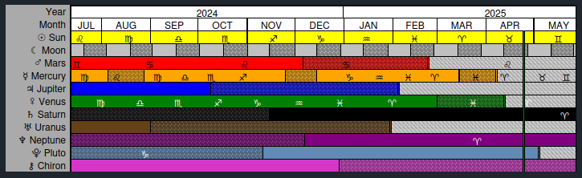
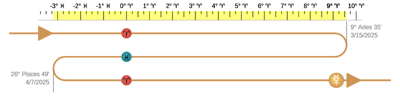
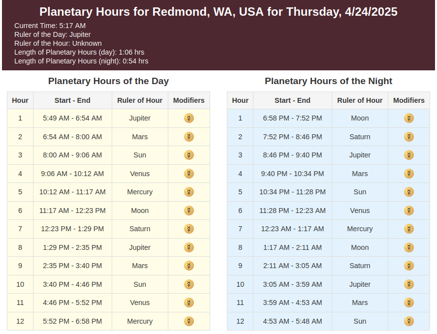
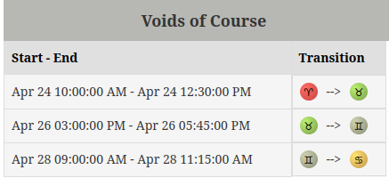

# AstrologyComponents
A collection of javascript DOM components for use in the display of astrology data.

### RetrogradeAndTransitGraphClass
Interactive timeline of planetary retrogrades and transits listing all planets in a single view.

### RetrogradeTrackerClass
An interactive retrograde tracking graph.

## Components
### PlanetaryHoursClass
An interactive planetary hours table.

### VoidOfCourseListClass
Interactive Moon void of course listing.

